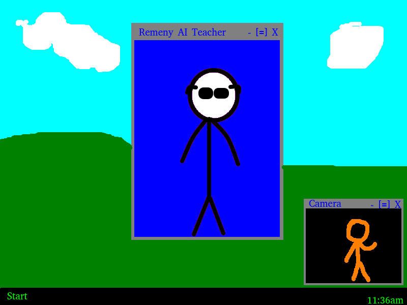

# AI-Teacher

## What is this?

This program is being developed as an easy way that people can use AI for getting taught by feeding it the lesson information.

## Why

Just trying & learing along the way

## Mockup

## Currently available features

 - Captures images with some cool UI

## Stuff I don't like

 - You have to look into the computer to take good pictures... But how are you going to do that if you have to turn your head left or something??

## Plans

 - Capture 10 photos of each head position
 - Use this to train a sci-kit AI which can predict where the user is looking
 
 - Use another AI that can learn from textbook texts
 - This AI must provide expressions and text
 
 - Text gets converted into speech (locally preffered)
 - Expressions gets translated into instructions that take effect on a 3D character which is displayed in a window (like a video call)
 
 - Add custom instructions that user can modify
 
 - User's movements gets translated as simple stuff like "USER_TURN_LEFT", which is fed into the AI
 - Alongside, user's voice gets translated as text and fed with it
 - The AI acts accordingly (eg. Command the user to look back, or command to move for 20 seconds after looking for 20 minutes or something)

## X ------ X